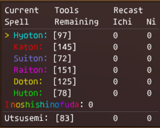

# ninjaCast
Addon for FFXI / AshitaXI v4 that includes the following:
 - Discrete / graphically adjustable shadow counter.
 - Display to show tool count & spell recast.
 - Simple wheel casting.

**Note:** This addon is not approved for use on HorizonXI. Please see ninjaTool (https://github.com/m4thmatic/ninjaTool) for a
HorizonXI approved version (single wheel macro casting / tracking has been removed). 

## Commands:
`/nin cast ich/ni/san *` *Cast the current spell - defaults to <t>, but can use your preferred modifier, e.g. `/nin cast ni <stnpc>`*
 `/nin next` *Move to next spell in the list (e.g. skip current spell)*
 `/nin prev` *Move to previous spell in the list*
